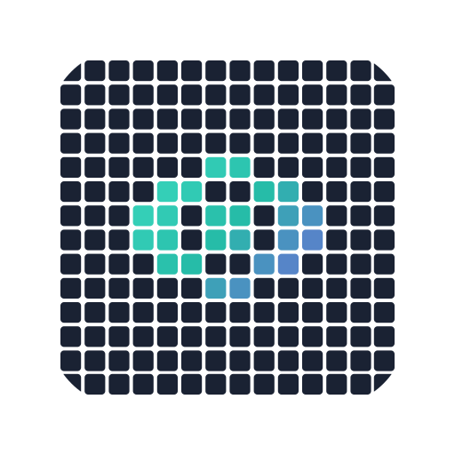

#  codeview

[](https://github.com/toaweme/codeview/actions/workflows/quality.yml)
<a href="https://code.toawe.me/toaweme/codeview/health">
    <picture>
        <source media="(prefers-color-scheme: dark)" srcset="https://code.toawe.me/toaweme/codeview/badge-dark.svg">
        <source media="(prefers-color-scheme: light)" srcset="https://code.toawe.me/toaweme/codeview/badge.svg">
        
    </picture>
</a>
[](https://github.com/toaweme/codeview/releases)
[](/LICENSE)

A fast, read-only web UI for your git repositories.

## Features

- Multi-organization dashboard, per organization and per repo views
- Repository lists with recent activity, branches and tags
- Works with any filesystem backed git hosting
- File tree, syntax highlighting, Markdown documents and raw downloads
- Commit log with an activity histogram, commit diffs and branch compare
- Blame view
- Fuzzy file finder
- Keyboard shortcuts

## Quickstart

```bash
docker run -p 8080:8080 -v ~/code:/repos:ro -e CODEVIEW_MODE=all ghcr.io/toaweme/codeview
```

Open http://127.0.0.1:8080.

## Install

### Docker

The image reads repositories from `/repos` and listens on port 8080. Mount your folder as read-only.

```bash
docker run -d --name codeview -p 8080:8080 -v /srv/git:/repos:ro ghcr.io/toaweme/codeview
```

Images are tagged with the release version and `latest`, for linux/amd64 and linux/arm64.

### Homebrew and Scoop

```bash
# homebrew (macos)
brew install toaweme/tap/codeview

# scoop (windows)
scoop bucket add toaweme https://github.com/toaweme/scoop-bucket
scoop install toaweme/codeview
```

### Binary

Download an archive for your OS and arch from the [releases page](https://github.com/toaweme/codeview/releases).

```bash
wget -qO- https://github.com/toaweme/codeview/releases/download/vX.Y.Z/codeview_X.Y.Z_linux_x64.tar.gz | tar xz
./codeview serve --dir /srv/git
```

### From source

Needs Go, Node and [Task](https://taskfile.dev).

```bash
git clone https://github.com/toaweme/codeview.git
cd codeview
task build
bin/codeview serve --dir /srv/git
```

## Usage

Codeview walks `--dir` up to five folders deep, follows symlinks, and picks up bare repositories and working copies.
Each repository is named after its `origin` remote, like `github.com/toaweme/cli`, or after its folder.

Only public repositories are shown by default, the ones holding a `git-daemon-export-ok` file.

```bash
touch /srv/git/cli.git/git-daemon-export-ok
```

`--mode all` shows every repository. There is no auth, so keep it behind a VPN, a LAN or an auth proxy.

```bash
codeview serve --dir /srv/git --mode all
```

## Repository setup

### Plain folder

```bash
git clone --mirror https://github.com/toaweme/cli.git /srv/git/cli.git
codeview serve --dir /srv/git
```

### soft-serve

Point Codeview at the `repos/` folder in soft-serve's data path. soft-serve tracks visibility in its own database, so touch `git-daemon-export-ok` in the repositories you want shown or use `--mode all`.

```bash
codeview serve --dir /var/lib/soft-serve/repos
```

### gickup

Mirror into a local destination as bare repositories.

```yaml
source:
  github:
    - user: toaweme
destination:
  local:
    - path: /srv/gickup
      structured: true
      bare: true
```

### Several sources

Symlink each source into one folder.

```bash
mkdir -p /srv/view
ln -sfn /var/lib/soft-serve/repos /srv/view/soft-serve
ln -sfn /srv/gickup /srv/view/gickup
codeview serve --dir /srv/view
```

With Docker, mount each source under `/repos` instead, since symlinks to host paths do not resolve inside the container.

```bash
docker run -d -p 8080:8080 \
  -v /var/lib/soft-serve/repos:/repos/soft-serve:ro \
  -v /srv/gickup:/repos/gickup:ro \
  -e CODEVIEW_MODE=all \
  ghcr.io/toaweme/codeview
```

## Configuration

Every flag of `codeview serve` also reads an environment variable. The Docker image sets `CODEVIEW_DIR=/repos` and `CODEVIEW_HOST=0.0.0.0`.

| Flag | Variable | Default | Description |
| --- | --- | --- | --- |
| `--dir` | `CODEVIEW_DIR` | `.` | Folder holding the git repositories |
| `--mode` | `CODEVIEW_MODE` | `public` | `public` or `all` |
| `--host` | `CODEVIEW_HOST` | `127.0.0.1` | Address to listen on |
| `--port` | `CODEVIEW_PORT` | `8080` | Port to listen on |
| `--git` | `CODEVIEW_GIT` | `git` | git executable |

## Deployment

### Repository maintenance

Codeview never fetches, so keep the repositories in sync with whatever mirrors them.
Optionally write a commit graph after each sync.
It speeds up history and blame on large repositories.

```bash
git --git-dir=/srv/git/cli.git commit-graph write --reachable --changed-paths
```

### Limits

Every uncached request runs git. Rate limit and cap concurrent requests in the reverse proxy, and bound the container.

```bash
docker run -d -p 8080:8080 --cpus 1 --memory 768m --pids-limit 256 \
  -v /srv/git:/repos:ro \
  ghcr.io/toaweme/codeview
```

### Caching

API responses are `private, no-cache` with an ETag, so browsers revalidate and get a `304` until a ref moves.
Hashed UI assets are cached for a year.
A CDN in front needs no cache rules.

## Development

Our [Blink](https://github.com/toaweme/blink) config boots soft-serve in docker, mirrors `dev/gickup.yml`, links soft-serve and gickup into `.data/view`, and runs the backend on 8080 beside the vite dev server on 5173.

```bash
blink
```

```bash
task seed    # mirror a few public repositories into .data/soft-serve/repos/seed
task check   # vet and test
task build   # build the UI, then bin/codeview with it embedded
```

Releases are built by goreleaser from a `v*` tag, which publishes the archives and the multi-arch image to `ghcr.io/toaweme/codeview`.

---

<p align="center">
  <a href="https://code.toawe.me/toaweme/codeview/health"><picture><source media="(prefers-color-scheme: dark)" srcset="https://code.toawe.me/toaweme/codeview/card-dark.svg"><source media="(prefers-color-scheme: light)" srcset="https://code.toawe.me/toaweme/codeview/card.svg"></picture></a>
  <a href="https://code.toawe.me/toaweme/codeview/code"><picture><source media="(prefers-color-scheme: dark)" srcset="https://code.toawe.me/toaweme/codeview/code-card-dark.svg"><source media="(prefers-color-scheme: light)" srcset="https://code.toawe.me/toaweme/codeview/code-card.svg"></picture></a>
</p>

---

Made with ❤️ in Lithuania 🇱🇹.
